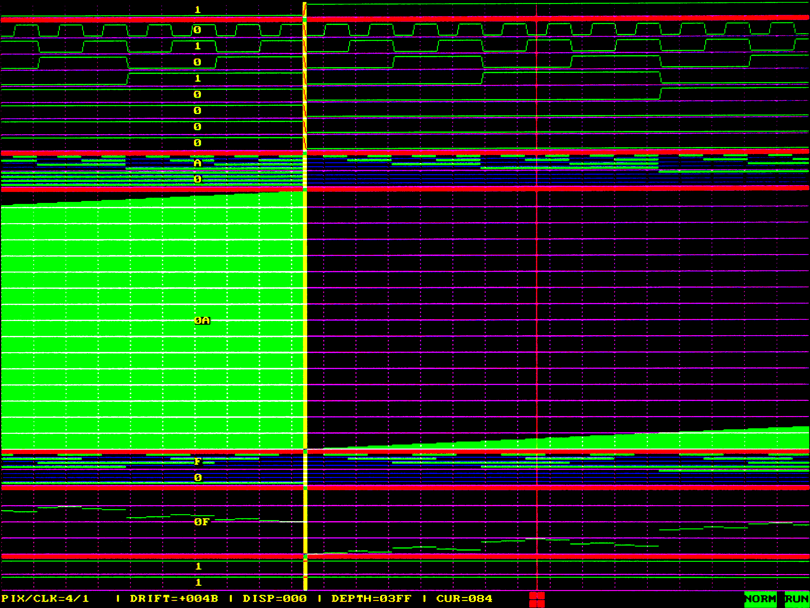

This is FPgaOscilloscope or Field-Programmable Oscilloscope
===========================================================

  FPO resides in FPGA along with the main project and allow to observe their
  signals.
  Only generic VGA monitor & ps/2 mouse and few resistors required to use.
  See connection schematic below.

Motivation and Goal
===================

FPO has designed for hard times, when another FPGA design produce "magical" 
behavior.

Generally it impractical or even impossible to use "real hardware oscilloscope"
for debugging a bunch of internal FPGA signals (simulation may give fine results
without problems because of simplified tests, and there is no reason to increase
test set complexity (e.g. try to implement asynchronous & noisy external inputs))

Multi-channel and close to "FPGA guts" nature of FPO can successfully used in
this situation.

Features
========
  Design:

  - Pure VHDL (no CPU core)
  - 7 external pin requited (5 for VGA output, 2 for PS/2 mouse IO)
    +1 optional: reset (for load default values mainly)
  - Wishbone compatibility: not applicable
  - Separated clock domains for acquisition and VGA-forming
    (3 clock domains: data acquisition, VGA-forming, PS/2 interface)
  - License: GPLv3

  Oscilloscope:

  - Normal, Single, Stop modes

  - Multi-channel: Each channel (line) has it own data type

  - Implemented types:
      - Single bit
      - Bus trail chart
      - Analog-like chart: dot and bar style

  - Configurable (excludable blocks) options:
    - Value indication (at cursor)

  - Future (planned) extensions:
    - Hold-off (trigger)
    - Auto mode
    - DVI-D output
    - video data processor (when sample/pixel > 1)

FPO (demo) consume about 2000 LUTs (dedicated RAM blocks).
(Acquisition RAM is dedicated)

Bugs/Limitations/Dubious features
=================================
- Run/Stop require double click to operate in SNGL mode
- Mouse data bounce sometimes

Thanks to:
==========

VGA timing info get from : http://tinyvga.com

Font get from..,, Sorry, I don't remember

Contact
=======

If you have a any questions do not hesitate to contact to
Bitmessage: BM-NBbq33AGcqJ9UAaQXLf7eNkzK1WtuRis

Donations
=========

You can support the developer or send ANY amount of BTC as a token of gratitude.

Bitcoin: 1AU25UGhVNrmvgXP3XQ3cXwiSp8gwTNdgq

--------------------------------------------------------------------------------

---

----- Details -----
=====================

Structure.
==========
 TBD.
 (FPO was written from scratch and in haste).

Tips(How-to)
============

Hardware.
--------

    Does it need more explanations after schematic below ?

VHDL.
----

    To evaluate FPO synthesize demo_pkg.vhd as top entity.
    In order to instantiate FPO required to use library units: fpoinc_pkg, 
    fpo_pkg.

    demo_pkg.vhd is the example of usage FPO in projects.

Configuration Option Usage:
---------------------------

__Copy fpocfg_pkg.vhd to your project directory and modify required parameters.__

  CFG: fpo_config: fill list of desired traces. Available types:

  - bit16 - plot 1 bit, trace height: 16.
  - bus16w4 - plot 4 bit like 4 parallel separate trails each 2 pix height
      with 2 pix space, total height: 16.
  - dot64u - 6 bit unsigned value plot as (unconnected) dot for each value,
      trace height 64.
  - bar64u - 6 bit unsigned value plot as vertical strip (height=value),
      trace height: 64.
  - bar256u - 8 bit unsigned value plot as vertical strip (height=value),
      trace height: 256.
  - separ4 - horizontal separator for grouping traces, no bit plotted,
      height : 4.

    Defining fpo_config entail (automatically) definition of fpo_data_type type
    as std_ulogic_vector with width equal to total sum of number of bits in
    each trace.
    Trace bits concatenation started from LSB of fpo_data_type. Use this type
    to connect probing signals to d port of fpo entity (see demo).

  CFG: traceval_enable : if true then value indication part will be included 
    (if false then preserve FPGA resource)

  CFG: drift_default, disp_default contain initial default values (loaded by
    means of reset) for correspondent working parameters. (see Parameter
    Explanation)

  CFG: scale_default, trgmode_default, act_default contain default values
    (loaded by means of reset) for correspondent working state (see Brief
    Operators Manual)

  CFG: depth_default contain total number of acquired samples-1 (per one
     working cycle) (see Parameter Explanation).

  CFG: ramlength : contain maxim number of samples which may be acquired by 
    given instance FPO (see Parameter Explanation).
    Total acquisition RAM size (bits): 3*ramlength*(fpo_data_type'width)

__Other files:__

  CFG: filter in trigger_pkg.vhd: if true then flip-flop will applied first to 
    trigger input signal. (recommended when trigger input signal is 
    not synchronous to clk)

  CFG: vbuf in graphics_pkg.vhd: if true then vc (vgaoutput) will be pipelines.
     Recommended: true. Experimental use only : if false then FPO performance 
     test by direct observation artifacts on display.

Synthesizing Demo Tips
----------------------

  Problem: insufficient RAM block resources.
  Fix: reduce ramlength (for example to 1024).

Trigger.
-------

  Trigger input (trg_input) is synchronous to clk/ena. Trigger is triggered by
  rising edge (actually by "first" 1 clocked in by clk/ena).

Probing
-------

  There is the problem to set up probe because current synthesizable VHDL do not
  support probing setup inside hierarchy layers of design. No one synthesis tool,
  I met, does not support shared, global or external variables or signals. You 
  need to route signals via all (underlying) layers to FPO input. 
  (Limited support only (in some cases): you can use one but referred from 
  single point of code, hence useless here :( )

GHDL
----

  just run make and enjoy diagrams in GTKWave by opening test.vcd.

  PS. I'm totally not understand how-to run this test in freehdl :(

Brief Operators Manual
======================

It simple intuitive :). Anyone who familiar with oscilloscopes is capable
to use FPO.

Status line is string line (last bottom line with yellow chars typically) 
indicating values of FPO control parameters.

All values are expressed in (hexadecimal) number of acquire clocks.

  - Scale:  explicitly represent pixel per acquiring clock ratio used to output
    acquired data to screen, Example: PIX/CLK=2/1 mean 2 pixel is used to 
    represent (plot) 1 clk period. (Zoom in toward 1/1)

  - Drift: see Parameter Explanation

  - Disp: see Parameter Explanation

  - Mode:
    - Normal: as ordinary oscilloscope -- start acquisition by trigger event.
    - Single: as ordinary oscilloscope -- start acquisition by trigger once, 
      manual restart required.

  - FPO state Run/Ready/Stop/Fill:

    - Run: Acquiring samples to RAM after trigger.
    - Stop: Acquiring is stopped and will not start without manual intervention.
    - Ready: Ready to Run (buffer has prefilled), awaiting trigger or manual start.
    - Fill: Prefill samples (trigger prehistory acquisition)

Control cursor is red square movable (by mouse) horizontally along status line.

To change parameter value (drift, disp) move control cursor on value, then
press and hold left mouse button and move mouse up/down to increment/decrement
value.

To change selector (scale, mode, activity) move control cursor on corresponded
indicated field and press left mouse button. Selector values are looped.

Activity selector: Start/Stop oscilloscope (or manual restart in single mode)
associated with FPO state field.

Parameter Explanation
=====================

positive drift :
<pre>
|<--------------ramlen--------------------------------->|
|                                                       |
|        |<---------depth------->|                      |
|        |                       |                      |
|        |        [ visible ]    |                      |
[========|========[  area   ]====|======================]
         |        [         ]
         |<-disp->|
         |           ^
         |<--drift-->E
                     ^
                     |
                  trigger (snap)
---time---->
</pre>

- ramlen -- total RAM length

- depth = [0..ramlen-1]  acquisition length (depth = 0 correspond to 1 sample,
  depth = n => n + 1 sample)

- disp = [0..depth] is offset of displayed (visible) area from acquisition beginning.

- drift = [-32768 to ramlen-1] is offset from the beginning of acquisition 
  (to RAM) to the trigger (snap) pulse (negative value correspond trigger pulse
   before start of acquisition)

Connection Schematic
====================
 <pre>
            \_\_\_\_\_\_\_\_\_\_\_\_\_\_\_\_\_\_\_\_\_\_\_\_\_\_\_\_\_\_\_\_\_\_\_\_\_\_\_\_                            \_\_\_\_\_\_\_\_\_\_\_\_
           |                       \_\_\_\_\_\_\_\_\_\_\_\_\_\_\_\_\_|                          |            |
           |      [DEMO]          |                 |          Rl \_\_\_          |     6      |
           |                      |      [FPO]      |          +-|\_\_\_|--<-GND>-------o      |
 \_\_\_\_\_\_\_   |                      |                 |  Rh \_\_\_  |               | 1       11 |
|       |  |                      |            vc.r |----|\_\_\_|-+-----------------o       o  |
|  OSC  |  |                      |                 |          Rl \_\_\_          |     7      |
|       |  |                      |                 |          +-|\_\_\_|--<-GND>-------o      |
| 50MHz |-->--+-------------------> clk             |  Rh \_\_\_  |               | 2       12 |
|\_\_\_\_\_\_\_|  |  |   \_\_\_\_\_\_\_\_\_\_\_\_\_   |            vc.g |----|\_\_\_|-+-----------------o       o  |
           |  |  |             |  |                 |          Rl \_\_\_          |     8      |
           |  |  |   divider   |  |                 |          +-|\_\_\_|--<-GND>-------o      |
           |  |  |             |  |                 |  Rh \_\_\_  |               | 3       13 |
           |  +--> clk         |  |            vc.b |----|\_\_\_|-+-----------------o       o--------
           |  |  |             |  |                 |                          |     9      |    |
           |  |  |      acqena |--| ena             |                          |     o      |    |
           |  |  |\_\_\_\_\_\_\_\_\_\_\_\_\_|  |                 |                          | 4       14 |    |
           |  |   \_\_\_\_\_\_\_\_\_\_\_\_\_   |                 |                          | o       o------ |
           |  |  |             |  |                 |                          |     10     |  | |
           |  |  |   counter   |  |                 |                      ----------o      |  | |
           |  |  |    coder    |  |                 |                      |   | 5       15 |  | |
           |  |  |             |  |                 |               <-GND>-+-----o       o  |  | |
           |  +--> clk         |  |                 |                          |\_\_\_\_\_\_\_\_\_\_\_\_|  | |
           |  |  |             |  |                 |  Rs \_\_\_                   VGA connector  | |
           |  |  |           q |==| d          vc.v |----|\_\_\_|---------------------------------- |
           |  |  |\_\_\_\_\_\_\_\_\_\_\_\_\_|  |                 |  Rs \_\_\_                                    |
           |  |                   |            vc.h |----|\_\_\_|------------------------------------
           |  +-------------------> vclk            |                               \_\_\_\_\_
           |  |                   |                 |         Ru \_\_\_              \_|     |\_
           |  |       [LOG1]------| vena            |  <+3.3V>--|\_\_\_|-+          |         |
           |  |                   |                 |                 | Rp \_\_\_   | 1     2 |
           |  +-------------------> ps2clk     ps2d |-----------------+---|\_\_\_|----o     o |
           |  |   \_\_\_\_\_\_\_\_\_\_\_\_\_   |                 |                            |         |
           |  |  |             |  |                 |                            |         |
           |  |  |   divider   |  |                 |                            | 3     4 |
           |  |  |             |  |                 |                     <-GND>---o  \_  o----<+5V>
           |  +--> clk         |  |                 |         Ru \_\_\_             |   [ ]   |
           |     |             |  |                 |  <+3.3V>--|\_\_\_|-+          |   [\_]   |
           |     |      ps2ena |--| ps2ena          |                 | Rp \_\_\_   | 5     6 |
           |     |\_\_\_\_\_\_\_\_\_\_\_\_\_|  |            ps2c |-----------------+---|\_\_\_|----o  _  o |
           |                      |\_\_\_\_\_\_\_\_\_\_\_\_\_\_\_\_\_|                            |\_\_\_| |\_\_\_|
           |\_\_\_\_\_\_\_\_\_\_\_\_\_\_\_\_\_\_\_\_\_\_\_\_\_\_\_\_\_\_\_\_\_\_\_\_\_\_\_\_|                           PS/2 connector
                           FPGA IC
 </pre>
Voltage levels & pins IO standard: VGA & PS2 IO is configured to lvcmos 3.3v.

Rh + Rl is divider-terminator matching 75 Ohm color transmission line.
May be selected from tables below. Rh can be reduced on about 20 Ohm because 
FPGA output driver has internal resistance. Suppose 141/161 pair is suitable
for most cases.

Voltage divider (theoretical) resistor values

       VGA 0.7 V
  IN  | Rl  | Rh  | CUR
  ----|-----|-----|----
  3.3 | 130 | 177 | 14.7
  3.0 | 141 | 161 | 14.3
  2.8 | 150 | 150 | 14.0

       VGA 1.0 V
  IN  | Rl  | Rh  | CUR
  ----|-----|-----|-----
  3.3 | 191 | 124 | 18.5
  3.2 | 200 | 120 | 18.3
  3.0 | 225 | 112 | 17.8
  2.7 | 300 | 100 | 16.7

Rs is series terminator for synchronization lines. Accurate impedance of this 
lines is unknown, suppose in range 60-120 Ohm. Rs about 60-80 Ohm should be fine.

Ru is pull-up for mouse lines. Ru = 2-4 kOhm should be fine.

Rp is kind of protection & spikes suppressor. Rp = 100-300 Ohm.
